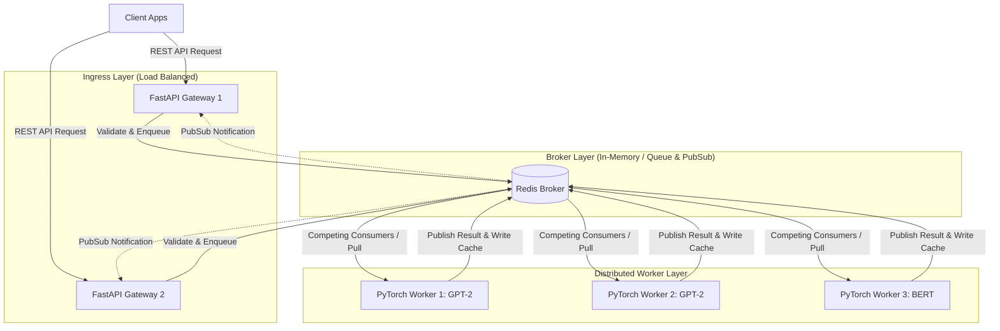
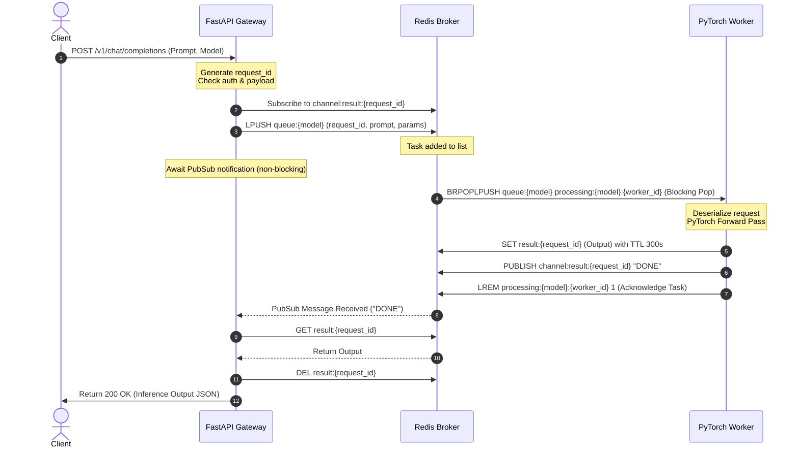
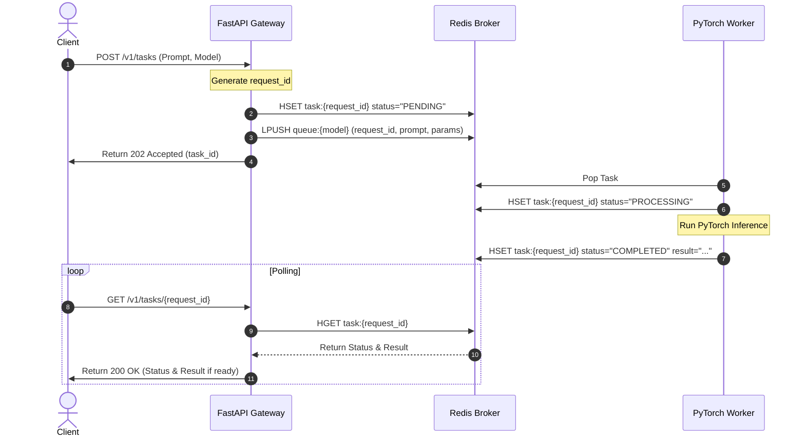

# System Architecture & Design
## CoreAI Distributed Inference Platform

This document describes the high-level design, component interactions, request lifecycles, and operational strategies of the CoreAI Distributed Inference Platform.

---

### 1. High-Level System Topology

The platform decouples HTTP ingress from CPU/GPU-heavy model execution. Below is the system topology illustrating the flow from clients to inference workers.



---

### 2. Request Lifecycle

The platform supports two request modes: **Synchronous (Blocking)** and **Asynchronous (Polling-based)**.

#### 2.1 Synchronous Request Lifecycle (Real-time Completions)
This flow simulates a standard synchronous LLM chat request (e.g. OpenAI style) while keeping the API gateway thread unblocked.



**Race Condition Handling:**
To prevent a fast worker from writing and publishing *before* the gateway registers its subscription (Steps 3 & 4), the gateway executes a fallback check:
1. Gateway subscribes to the channel.
2. Gateway enqueues the task.
3. Gateway runs a fast `EXISTS result:{request_id}` check. If `True`, it bypasses the PubSub await block and immediately fetches the result.

#### 2.2 Asynchronous Request Lifecycle (Batch / Long-Running Tasks)
For batch jobs or offline requests where the client does not want to keep an open HTTP connection.



---

### 3. Component Design

#### 3.1 API Gateway (FastAPI)
The entry point of all client traffic. Built using FastAPI to leverage async/await ASGI performance.
* **Router Layer**: Handles endpoints `/v1/chat/completions`, `/v1/tasks`, `/v1/models`, `/health`, and `/metrics`.
* **Security Middleware**: Authenticates incoming requests via API key comparison against a whitelist configuration. Enforces request size limits.
* **Broker Connector**: Coordinates connection pooling to Redis. Implements async PubSub subscription handlers.
* **Metrics Collector**: Exposes Prometheus-instrumented metrics (requests, latency, status codes) using `prometheus_client`.

#### 3.2 Message Broker & Storage (Redis)
Acts as the central coordination plane. Redis is chosen for its sub-millisecond latency and versatile data structures.
* **Task Queues**: Represented by Redis Lists (`queue:<model_name>`).
* **Processing Queues**: Used for failure recovery (`processing:<model_name>:<worker_id>`).
* **Task State Hash**: Redis Hashes (`task:<request_id>`) storing metadata (status, timestamp, worker_id, result) for asynchronous execution tracking.
* **PubSub Broker**: Handles real-time messaging back to waiting gateway instances.

#### 3.3 PyTorch Inference Worker
A dedicated, long-running daemon written in Python.
* **Model Manager**: Pre-loads PyTorch models (GPT-2, BERT, etc.) onto GPU (CUDA) or CPU memory during startup.
* **Queue Reader**: Blocks on the Redis queue using a safe pop pattern.
* **Dynamic Batching Engine**: (Moved to Future Enhancements).
* **Execution Engine**: Wraps model evaluation inside `torch.no_grad()` to disable gradient calculation, minimizing memory footprint and accelerating inference.

---

### 4. Load Balancing Strategy

The platform implements load balancing at two distinct levels:

```
[ Clients ]
    │
    ▼ (HTTP Load Balancer: Round-Robin / Least Connections)
[ API Gateways ]
    │
    ▼ (Broker Push: Shared Redis Queue)
[ Redis Tasks Queue ]
    │
    ▼ (Pull: Competing Consumers)
[ PyTorch Workers ]
```

1. **HTTP Ingress Level**: API Gateway instances are scaled horizontally behind a standard HTTP load balancer (e.g. Nginx, Envoy, or Azure Load Balancer). Traffic is distributed using round-robin or least-connections policies.
2. **Worker Inference Level**: Dynamic load balancing is naturally achieved via the **Competing Consumers Pattern**. Workers pull tasks from the shared Redis queue when they have spare capacity. If worker A is busy running inference, worker B will pull the next task from the queue. This prevents over-allocation and guarantees self-balancing load distribution.

---

### 5. Failure Recovery & Reliability Strategy

#### 5.1 Worker Node Crash Recovery (Reliable Queue Pattern)
If a worker pops a task and instantly crashes (e.g. due to hardware fault or Out of Memory error), the task must not be lost.
* **Pattern**: We utilize the Redis `RPOPLPUSH` (or atomic list moves) to move a task from the active `queue:{model}` to a worker-specific tracking queue `processing:{model}:{worker_id}`.
* **Heartbeat & Reaper**: An administrative daemon (or a thread in the gateway) periodically scans all worker processing queues. If a task remains in a processing queue longer than a threshold (e.g. 30 seconds) and the associated worker's heartbeat key in Redis has expired, the task is re-queued back to `queue:{model}` and a retry count is incremented.
* **Dead Letter Queue (DLQ)**: If a task fails more than 3 times, it is pushed to a Dead Letter Queue (`queue:dlq`) to prevent infinite poison pill loops.

#### 5.2 Redis Broker Failure
* **Persistence**: Redis is configured with both RDB snapshots and AOF (Append Only File) persistence to ensure queue state survives unexpected restarts.
* **Retry Engine**: The API gateway and workers employ connection retry handlers with exponential backoff and jitter. If Redis disconnects, the gateway buffers requests temporarily (up to capacity) or returns HTTP 503 (Service Unavailable) rather than crashing.

---

### 6. Scalability Discussion

#### 6.1 Horizontal Worker Scaling
Inference capability is scaled by running more worker container instances. The API Gateways do not need to know the IPs or count of workers. Scaling workers up or down is as simple as:
```bash
docker-compose up -d --scale worker-gpt2=4
```

#### 6.2 Dynamic Batching (Future Enhancement)
This feature is moved to Future Enhancements to simplify the MVP implementation. In future versions, workers will gather multiple concurrent prompts over a small time window and stack them into a single batch tensor forward pass to maximize GPU utilization.

#### 6.3 Queue-based Backpressure
If inference demands exceed worker throughput, the Redis queue will grow. The API gateway monitors queue depth. If `LLEN queue:{model}` exceeds a safety threshold, the gateway immediately returns `HTTP 429 Too Many Requests`, protecting the platform from memory exhaustion.

---

### 7. Security Considerations

1. **Authentication**: All API endpoints require a bearer token matching the configured `COREAI_API_KEY`.
2. **Rate Limiting**: (Moved to Future Enhancements).
3. **Input Sanitization**: Maximum prompt lengths (e.g., character count limits) are validated at ingress by FastAPI to protect PyTorch workers from processing excessively long sequences that could cause Out of Memory (OOM) errors.
